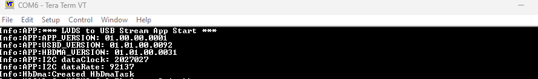

# EZ-USB&trade; FX20: LVDS USB streaming application

This code example demonstrates the usage of Infineon's EZ-USB&trade; devices to stream data received through the LVDS interface to a USB In endpoint. A vendor-specific USB device implementation with a single bulk endpoint is used to transfer the data received over LVDS to the USB host.

> **Note:** This code example is applicable to EZ-USB&trade; FX20, EZ-USB&trade; FX10, and EZ-USB&trade; FX5 devices.

[View this README on GitHub.](https://github.com/Infineon/mtb-example-fx20-lvds-usb-stream)

[Provide feedback on this code example.](https://yourvoice.infineon.com/jfe/form/SV_1NTns53sK2yiljn?Q_EED=eyJVbmlxdWUgRG9jIElkIjoiQ0UyNDE1MzQiLCJTcGVjIE51bWJlciI6IjAwMi00MTUzNCIsIkRvYyBUaXRsZSI6IkVaLVVTQiZ0cmFkZTsgRlgyMDogTFZEUyBVU0Igc3RyZWFtaW5nIGFwcGxpY2F0aW9uIiwicmlkIjoic3VtaXQua3VtYXJAaW5maW5lb24uY29tIiwiRG9jIHZlcnNpb24iOiIxLjAuMSIsIkRvYyBMYW5ndWFnZSI6IkVuZ2xpc2giLCJEb2MgRGl2aXNpb24iOiJNQ0QiLCJEb2MgQlUiOiJXSVJFRCIsIkRvYyBGYW1pbHkiOiJTU19VU0IifQ==)


## Requirements

- [ModusToolbox&trade;](https://www.infineon.com/modustoolbox) v3.4 or later (tested with v3.4)
- Board support package (BSP) minimum required version: 4.3.3
- Programming language: C


## Supported toolchains (make variable 'TOOLCHAIN')

- GNU Arm&reg; Embedded Compiler v11.3.1 (`GCC_ARM`) – Default value of `TOOLCHAIN`
- Arm&reg; Compiler v6.22 (`ARM`)


## Supported kits (make variable 'TARGET')

- [EZ-USB&trade; FX20 DVK](https://www.infineon.com/fx20) (`KIT_FX20_FMC_001`) – Default value of `TARGET`


## Hardware setup

This example uses the board's default configuration. See the kit user guide to ensure that the board is configured correctly.

This example demonstrates the implementation of a vendor-specific LVDS to USB streaming application using the [Titanium Ti180 J484 Development Kit](https://www.efinixinc.com/products-devkits-titaniumti180j484.html) as the data source.

> **Note:** The Titanium Ti180 J484 Development Kit is used for demonstration purposes only. The Ti180 FPGA bitfile listed in **Table 7** of the [FPGA BitFile information](#fpga-bitfile-information) Section supports the generation of data streams at rates up to 16 Gbps.


## Software setup

See the [ModusToolbox&trade; tools package installation guide](https://www.infineon.com/ModusToolboxInstallguide) for information about installing and configuring the tools package.

Install a terminal emulator if you do not have one. Instructions in this document use [Tera Term](https://teratermproject.github.io/index-en.html).

Install the [EZ-USB&trade; FX Control Center](https://softwaretools.infineon.com/tools/com.ifx.tb.tool.ezusbfxcontrolcenter) application for assistance with device programming and testing.

Install the [Efinity Software](https://www.efinixinc.com/products-efinity.html) application to program the bit file to the FPGA in the Titanium Ti180 J484 Development Kit.


## Using the code example


### Create the project

The ModusToolbox&trade; tools package provides the Project Creator as both a GUI tool and a command line tool.

<details><summary><b>Use Project Creator GUI</b></summary>

1. Open the Project Creator GUI tool

   There are several ways to do this, including launching it from the dashboard or from inside the Eclipse IDE. For more details, see the [Project Creator user guide](https://www.infineon.com/ModusToolboxProjectCreator) (locally available at *{ModusToolbox&trade; install directory}/tools_{version}/project-creator/docs/project-creator.pdf*)

2. On the **Choose Board Support Package (BSP)** page, select a kit supported by this code example. See [Supported kits](#supported-kits-make-variable-target)

   > **Note:** To use this code example for a kit not listed here, you may need to update the source files. If the kit does not have the required resources, the application may not work

3. On the **Select Application** page:

   a. Select the **Applications(s) Root Path** and the **Target IDE**

      > **Note:** Depending on how you open the Project Creator tool, these fields may be pre-selected for you

   b. Select this code example from the list by enabling its check box

      > **Note:** You can narrow the list of displayed examples by typing in the filter box

   c. (Optional) Change the suggested **New Application Name** and **New BSP Name**

   d. Click **Create** to complete the application creation process

</details>


<details><summary><b>Use Project Creator CLI</b></summary>

The 'project-creator-cli' tool can be used to create applications from a CLI terminal or from within batch files or shell scripts. This tool is available in the *{ModusToolbox&trade; install directory}/tools_{version}/project-creator/* directory.

Use a CLI terminal to invoke the 'project-creator-cli' tool. On Windows, use the command-line 'modus-shell' program provided in the ModusToolbox&trade; installation instead of a standard Windows command-line application. This shell provides access to all ModusToolbox&trade; tools. You can access it by typing "modus-shell" in the search box in the Windows menu. In Linux and macOS, you can use any terminal application.

The following example clones the "[mtb-example-fx20-lvds-usb-stream](https://github.com/Infineon/mtb-example-fx20-lvds-usb-stream)" application with the desired name "LVDS_USB_Stream" configured for the *KIT_FX20_FMC_001* BSP into the specified working directory, *C:/mtb_projects*:

   ```
   project-creator-cli --board-id KIT_FX20_FMC_001 --app-id mtb-example-fx20-lvds-usb-stream --user-app-name LVDS_USB_Stream --target-dir "C:/mtb_projects"
   ```

The 'project-creator-cli' tool has the following arguments:

Argument | Description | Required/optional
---------|-------------|-----------
`--board-id` | Defined in the <id> field of the [BSP](https://github.com/Infineon?q=bsp-manifest&type=&language=&sort=) manifest | Required
`--app-id`   | Defined in the <id> field of the [CE](https://github.com/Infineon?q=ce-manifest&type=&language=&sort=) manifest | Required
`--target-dir`| Specify the directory in which the application is to be created if you prefer not to use the default current working directory | Optional
`--user-app-name`| Specify the name of the application if you prefer to have a name other than the example's default name | Optional

<br>

> **Note:** The project-creator-cli tool uses the `git clone` and `make getlibs` commands to fetch the repository and import the required libraries. For details, see the "Project creator tools" section of the [ModusToolbox&trade; tools package user guide](https://www.infineon.com/ModusToolboxUserGuide) (locally available at {ModusToolbox&trade; install directory}/docs_{version}/mtb_user_guide.pdf).

</details>


### Open the project

After the project has been created, you can open it in your preferred development environment.


<details><summary><b>Eclipse IDE</b></summary>

If you opened the Project Creator tool from the included Eclipse IDE, the project will open in Eclipse automatically.

For more details, see the [Eclipse IDE for ModusToolbox&trade; user guide](https://www.infineon.com/MTBEclipseIDEUserGuide) (locally available at *{ModusToolbox&trade; install directory}/docs_{version}/mt_ide_user_guide.pdf*).

</details>


<details><summary><b>Visual Studio (VS) Code</b></summary>

Launch VS Code manually, and then open the generated *{project-name}.code-workspace* file located in the project directory.

For more details, see the [Visual Studio Code for ModusToolbox&trade; user guide](https://www.infineon.com/MTBVSCodeUserGuide) (locally available at *{ModusToolbox&trade; install directory}/docs_{version}/mt_vscode_user_guide.pdf*).

</details>


<details><summary><b>Command line</b></summary>

If you prefer to use the CLI, open the appropriate terminal, and navigate to the project directory. On Windows, use the command-line 'modus-shell' program; on Linux and macOS, you can use any terminal application. From there, you can run various `make` commands.

For more details, see the [ModusToolbox&trade; tools package user guide](https://www.infineon.com/ModusToolboxUserGuide) (locally available at *{ModusToolbox&trade; install directory}/docs_{version}/mtb_user_guide.pdf*).

</details>


### Using this code example with specific manufacturer part numbers (MPNs)

By default, the code example build is targeted for the CYUSB4024-BZXI MPN, which has 512 KB of flash memory and 1024 KB of buffer RAM. Use the **BSP Assistant** tool to modify the application to target different EZ-USB&trade; FX20, EZ-USB&trade; FX10, EZ-USB&trade; FX5N, or EZ-USB&trade; FX5 family MPNs as shown in **Table 1**.

> **Note:** This application utilizes the Quad SPI interface on the EZ-USB&trade; FX device and hence is not supported on CYUSB4022-FCAXI, CYUSB4012-FCAXI, CYUSB3282-FCAXI, and CYUSB3082-FCAXI devices.

**Table 1. MPNs supported by this code example**

Part Number       | Family | Flash size (KB) | Buffer RAM size (KB)
:---------------- | :----- | :-------------- | :-------------------
CYUSB4024-BZXI    | FX20   | 512             | 1024
CYUSB4021-FCAXI   | FX20   | 512             | 1024
CYUSB4014-FCAXI   | FX10   | 512             | 1024
CYUSB4013-FCAXI   | FX10   | 512             | 1024
CYUSB4011-FCAXI   | FX10   | 512             | 1024
CYUSB3284-FCAXI   | FX5N   | 512             | 1024
CYUSB3084-FCAXI   | FX5    | 512             | 1024
CYUSB3083-FCAXI   | FX5    | 512             | 1024
CYUSB3081-FCAXI   | FX5    | 512             | 512


#### Setup for a different MPN

Perform the following steps to modify the code example to work on a different MPN, as listed in **Table 1**:

1. Launch the BSP Assistant tool:

   a. **Eclipse IDE:** Launch the BSP Assistant tool by navigating to **Quick Panel** > **Tools**

   b. **Visual Studio Code:** Select the ModusToolbox&trade; extension from the left menu bar and launch the BSP Assistant tool, which is available in the **Application** menu of the **MODUSTOOLBOX TOOLS** section

2. In **BSP Assistant**, select **Devices** from the tree view on the left

3. Choose the desired part from the dropdown menu on the right

4. Click "Save" to close the BSP Assistant tool

5. Build the application and proceed with programming


## Operation

1. Connect the board (J2) to your PC using the provided USB cable

2. Connect the USB FS port (J3) on the board to the PC for debug logs

3. Open a terminal program and select the serial COM port. Set the serial port parameters to 8N1 and 921600 baud

4. Browse the *\<CE Title>/BitFiles/* folder for Ti180 FPGA binary and program the FPGA. For more details, see the [J484 kit user guide](https://www.efinixinc.com/products-devkits-titaniumti180j484.html)

5. After successful programming, switch off the FPGA DVK power, connect the FPGA (Titanium Ti180 J484 Development Kit) DVK to the FMC (J8) connector of the KIT_FX20_FMC_001 board, and switch on the FPGA DVK power

6. Perform the following steps to program the board using the EZ-USB&trade; FX Control Center (Alpha) application

   1. To enter Bootloader mode:

         a. Press and hold the PMODE (SW2) switch

         b. Press and release the RESET (SW3) switch

         c. Release the PMODE switch

   2. Open the EZ-USB&trade; FX Control Center application. Observe the EZ-USB&trade; FX20 device displayed as **EZ-USB&trade; FX Bootloader**

   3. Select the **EZ-USB&trade; FX Bootloader** device in EZ-USB&trade; FX Control Center

   4. Click **Program** > **Internal Flash**

   5. Navigate to the *\<CE Title>/build/APP_KIT_FX20_FMC_001/Release* folder within the CE directory and locate the *.hex* file and program. Confirm if the programming is successful in the log window of the EZ-USB&trade; FX Control Center application

7. After programming, the application starts automatically. Confirm the following title is displayed on the UART terminal

   **Figure 1. Terminal output on program startup**

   

8. Launch EZ-USB&trade; FX Control Center and verify the **EZ-USB FX20** device is listed with one bulk In endpoint

9. Switch to the *Performance Measurement* tab of the application, select **Bulk In Endpoint (0x81)** and click on *Start* to continuously read the data and display the data rate information


## Debugging


### Using the Arm&reg; debug port

If you have access to a MiniProg or KitProg3 device, you can debug the example to step through the code.


<details><summary><b>In Eclipse IDE</b></summary>

Use the **\<Application Name> Debug (KitProg3_MiniProg4)** configuration in the **Quick Panel**. For details, see the "Program and debug" section in the [Eclipse IDE for ModusToolbox&trade; user guide](https://www.infineon.com/MTBEclipseIDEUserGuide).

</details>


<details><summary><b>In other IDEs</b></summary>

Follow the instructions in your preferred IDE.

</details>


### Log messages

The code example and the EZ-USB&trade; FX20 stack output debug log messages indicate any unexpected conditions and highlight the performed operations.

By default, the USB FS port is enabled for debug logs. To enable debug logs on UART, set the `USBFS_LOGS_ENABLE` compiler flag to '0u' in the *Makefile* file. SCB1 of the EZ-USB&trade; FX20 device is used as UART with a baud rate of 921600 to send out log messages through the P8.1 pin.

The verbosity of the debug log output can be modified by setting the `DEBUG_LEVEL` macro in the *main.c* file with the values shown in **Table 2**.

**Table 2. Debug values**

Macro value | Description
:--------   | :------------
1u          | Enable only error messages
2u          | Enable error and warning messages
3u          | Enable error, warning, and info messages
4u          | Enable all message types


## Design and implementation

This code example demonstrates how the DMA capabilities of the EZ-USB&trade; FX20 device can be used to continously stream data between the LVDS and USB interfaces at speeds upto 16 Gbps. The application utilizes the Ti180 FPGA as a data source which sends data to the FX20 device whenever it is ready to receive the data. The application also uses the following peripheral interfaces:

- Serial communication block 0 (SCB0) as an I2C master to configure the data source
- Enable debug prints over CDC using the USBFS block on the EZ-USB&trade; FX20 device


### Features

- **USB specification:** USB 2.0 (High-Speed only) and USB3.2 Gen2/Gen1

- FPGA configuration using SMIF block. The application supports FPGA configuration in Passive serial (x4) mode only


### LVDS interface

This code example uses a WideLink LVDS interface with 16 data lanes to receive data from the Ti180 FPGA. The LVDS interface operations with a clock frequency of 148.5 MHz and 8:1 gearing ratio, providing a maximum theoretical data rate of 19 Gbps.

In addition to the LVDS clock, control, and data lanes, a pair of LVCMOS control signals are used to indicate the status of the LVDS receiver on the FX20 to the FPGA master.

**Table 3. Control signal usage in the FX20 to FPGA interface**

EZ-USB&trade; FX pin | Function   | Description
:-------------       | :--------  | :--------------
P0CTL5               | FlagA      | Active low DMA ready indication for currently addressed or active thread
P0CTL6               | Link Ready | Signal that requests the FPGA to start the PHY and LINK training process


### I2C control register interface

Once configured with the bit files associated with this code example, Ti180 implements a I2C control register interface, which allows the FX20 firmware to control its operation. See [AN241535: Designing LVDS transmitter in FPGA to interface with EZ-USB&trade; FX20 controller](https://www.infineon.com/dgdl/Infineon-Designing_lvds_transmitter_in_fpga_to_interface_with_ez-usb_fx20_fx10_fx5_fx5n_controller-ApplicationNotes-v01_00-EN.pdf?fileId=8ac78c8c962508060196d2fe77d81147) for details of the I2C control registers and the FPGA operation.

In summary, the FPGA can be configured to generate a data stream with the desired data rate and transfer to the LVDS receiver sockets on the FX20 device.


### Streaming data path

- The application enables EP 1-In as a bulk endpoint with a maximum packet size of 1024 bytes. In case of USB3.2 Gen1/Gen2, the endpoint is configured to support a maximum burst of 16 packets

- The device receives the data through LVDS Adapter 0 Socket 0 and sends it on EP 1-In

- Three DMA buffers of 64512 bytes size are used to hold the data while it is being forwarded to USB

- In case of USB 3.x connections, an **auto** DMA channel is used so no firmware involvement is required for the data transfer

- In case of USB 2.x connections, DMA callbacks are used to trigger transfers to the USB In endpoint block using DataWire channels


### Application workflow

The application flow involves three main steps:

- [Initialization](#initialization)
- [USB device enumeration](#usb-device-enumeration)
- [Data transfer](#data-transfer)


#### Initialization

During initialization, the following steps are performed:

1. All the required data structures are initialized

2. FPGA is brought out of reset and configured. On the Ti180 DVK, the FPGA configures itself using Active Serial mode and then asserts the CDONE pin to indicate the configuration is complete

3. LVDS interface on FX20 is enabled and configured

4. FPGA is configured through I2C registers to generate the PHY and LINK training patterns required by FX20

5. USBD and USB driver (CAL) layers are initialized

6. The application registers all descriptors supported by function/application with the USBD layer

7. The application registers callback functions for different events, such as `RESET`, `SUSPEND`, `RESUME`, `SET_CONFIGURATION`, `SET_INTERFACE`, `SET_FEATURE`, and `CLEAR_FEATURE`. USBD will call the respective callback function when the corresponding events are detected

8. The data transfer state machines are initialized

9. The application registers handlers for all relevant interrupts

10. The application makes the USB device visible to the host by calling the Connect API


#### USB device enumeration

1. During USB device enumeration, the host requests for descriptors, which are already registered with the USBD layer during the initialization phase

2. The host sends the `SET_CONFIGURATION` command to activate the required function in the device

3. After the `SET_CONFIGURATION` command, the application task takes control, enables the bulk endpoint, and sets up the DMA channels required for data transfer


#### Data transfer

**Loopback mode (LVDS interface):**

1. Loopback program (data pattern and control bytes) is stored in HBWSS SRAM

2. Data is moved by Thread 3 to Port 1 through DMA and GPIF

3. Link level loopback is enabled so the data generated by PORT 1 is received by Port 0

4. Data moves from Port 0 to USB 3.x Bulk endpoint-In through GPIF and DMA

5. Data moves from device Bulk endpoint-In to the host application

**Normal mode:**

1. After the streaming DMA channel is enabled, the DMA ready flag on the SIP interface asserts and the FPGA data source starts streaming data to the EZ-USB&trade; FX20 device

2. Data moves from the LVDS subsystem to SRAM through high-bandwidth DMA

3. The data is forwarded on the USBSS or USBHS EP 1-In, based on the active USB connection speed. DataWire DMA channels are used for USBHS transfers and high-bandwidth DMA channels are used for USBSS transfers

4. Data moves from USB device bulk endpoint-In to the host application


## Compile-time configurations

This application's functionality can be customized by setting variables in *Makefile* or by configuring them through `make` CLI arguments.

- Run the `make build` command or build the project in your IDE to compile the application and generate a USB bootloader-compatible binary. This binary can be programmed onto the EZ-USB&trade; FX20 device using the EZ-USB&trade; Control Center application

- Run the `make build BLENABLE=no` command or set the variable in *Makefile* to compile the application and generate the standalone binary. This binary can be programmed onto the EZ-USB&trade; FX20 device through the SWD interface using the OpenOCD tool. For more details, see the [EZ-USB&trade; FX20 SDK user guide](https://www.infineon.com/fx20)

- Choose between the **Arm&reg; Compiler** or the **GNU Arm&reg; Embedded Compiler** build toolchains by setting the `TOOLCHAIN` variable in *Makefile* to `ARM` or `GCC_ARM` respectively. If you set it to `ARM`, ensure to set `CY_ARM_COMPILER_DIR` as a make variable or environment variable, pointing to the path of the compiler's root directory

- Run the `make build LPBK_EN=yes` command or set the variable in *Makefile* to make the application use an internally-generated data pattern for streaming instead of the data sourced by the FPGA. This configuration can be used on the EZ-USB&trade; FX20 DVK without requiring any additional boards or connections

> **Note:** The internal data path used for this function has throughput limitations and can only support data rates of up to 6.4 Gbps. Using an external data source is required to achieve the data rates enabled by the USB 3.2 Gen2 data connection.

By default, the application is configured to receive data through a single LVDS socket and make a USB 3.2 Gen2x2 (20 Gbps) data connection. Additional settings can be configured through macros specified by the `DEFINES` variable in *Makefile*:

**Table 4. Macro descriptions** 

Macro name           |    Description                    | Allowed values
:-------------       | :------------                     | :--------------
`USB_CONN_TYPE`      | Choose USB connection speed from a set of options | `CY_USBD_USB_DEV_SS_GEN2X2` for USB 3.2 Gen2x2<br>`CY_USBD_USB_DEV_SS_GEN2` for USB 3.2 Gen2x1 <br> `CY_USBD_USB_DEV_SS_GEN1X2` for USB 3.2 Gen1x2 <br> `CY_USBD_USB_DEV_SS_GEN1` for USB 3.2 Gen1x1<br>`CY_USBD_USB_DEV_HS` for USB 2.0 HS <br> `CY_USBD_USB_DEV_FS` for USB 1.1 FS
`LVDS_LB_EN`         | Enable link loopback                              | '1u' to enable link loopback <br> '0u' to disable link loopback
`PORT0_THREAD_INTLV` | Enable thread interleave on Port 0                | '1u' to enable thread interleaving so data is received through two interleaved LVDS threads
`USBFS_LOGS_ENABLE`  | Enable debug logs through the USBFS port          | '1u' for debug logs over USBFS <br> '0u' for debug logs over UART (SCB1)
`FPGA_CONFIG_EN`     | Enable FPGA configuration                         | '1u' to enable FPGA configuration by the FX  device <br> '0u' to disable FPGA configuration using the FX device
`CUSTOM_TRAIN_ENABLE`| Enable firmware-based LVDS PHY training           | '1u' to use firmware-based LVDS PHY training<br> '0u' to use hardware-based LVDS PHY training


## FPGA configuration


### FPGA configuration on the J484 Development Kit

The Ti180 FPGA configures itself by reading data from the on-board SPI flash memory on the J484 Development Kit. The bitfile used in this application can be programmed to the J484 kit using the Efinity Programmer tool. For more details, see the [J484 kit user guide](https://www.efinixinc.com/products-devkits-titaniumti180j484.html).

On every bootup, the EZ-USB&trade; FX device uses the INT_RESET pin to reset the FPGA and cause it to load the bitfile from the SPI flash memory. Once the Ti180 FPGA has configured itself, it will assert the CDONE pin high to indicate that configuration is complete. The FX application waits until high status is detected on the CDONE pin before moving to the next steps.

**Table 5. GPIO for checking FPGA configuration on KIT_FX20_FMC_001 DVK**

EZ-USB&trade; FX20 pin | Function        | Description
:-------------         | :------------   | :--------------
P4_3                   | INT_RESET#      | Active low signal. EZ-USB&trade; FX device asserts to reset the FPGA
P4_4                   | CDONE#          | Active high signal. FPGA asserts when configuration is complete


### FPGA configuration on EZ-USB&trade; FX20 USB MIPI camera demo kit

This code example can be adapted to work on the [FX20 USB MIPI camera demo kit](https://www.infineon.com/assets/row/public/documents/24/44/infineon-ez-usb-fx20-demo-board-demo-fx20-mipi-001-usermanual-en.pdf) where the FPGA bitfile is stored on a Quad SPI (QSPI) flash memory connected to the FX20 device. In this case, the FPGA is configured in passive serial mode while FX20 reads the bitfile content from the QSPI memory.


#### Programming FPGA bitfile on EZ-USB&trade; FX20 USB MIPI camera demo kit

The FPGA binary in the *BitFile* folder of the project can be programmed to the external flash on the EZ-USB&trade; FX20 DVK using the EZ-USB&trade; FX20 USB Bootloader. Perform the following steps to program the binary file to the external flash.

> **Note:** The following steps are assuming that the device is pre-programmed with the EZ-USB&trade; FX20 USB Bootloader.

1. Switch the FX20 device into bootloader mode by resetting it while keeping the PMODE switch pressed
2. Open the EZ-USB&trade; FX Control Center application and select the **EZ-USB FX BOOTLOADER** device
3. Select **Program** > **External SPI Flash** from the menu bar and and navigate to the FPGA bitfile in bin format
4. Wait until programming is completed and verify the status


#### FPGA configuration in passive serial mode

To enable FPGA configuration in passive serial mode with EZ-USB&trade; FX, set `FPGA_CONFIG_EN` in **Makefile** to 1. 

FPGA configuration can be performed using the SMIF block of FX. The SMIF (in x4 or Quad mode) interface is used for downloading the FPGA configuration binary on every bootup. FPGA binary files support passive serial x4 configuration mode.

Steps to configure FPGA (in Passive serial x4 mode):

1. EZ-USB&trade; FX deasserts the INT_RESET pin
2. EZ-USB&trade; FX starts sending dummy SMIF (in x4 or Quad mode) clock to read the FPGA BitFile from SPI flash
3. FPGA listens to the data on the SMIF lines and configures itself
4. FPGA asserts CDONE# when the configuration is complete

**Table 6. GPIOs for configuring FPGA on the FX20 USB MIPI camera demo kit**

EZ-USB&trade; FX20 pin | Function      | Description
:-------------         | :------------ | :--------------
P4_4                   | CDONE#        | Active high signal; FPGA asserts when FPGA configuration is completed
P4_3                   | INT_RESET#    | Active low signal; EZ-USB&trade; FX asserts to reset the FPGA
P6_4                   | PROG#         | Active low FPGA program signal


### FPGA BitFile information

**Table 7. BitFile description**
BitFile                                                   | Description                   | Supported features
:-------------                                            | :------------                 | :------------  
*fxn_ti180_dvk_multi_cam_ref_des_clbr_max_thrpt_120_fps.hex* | LVDS WideLink at 16 Gbps   | Colorbar data generation at 16 Gbps
*fxn_ti180_dvk_multi_cam_ref_des_clbr_training_update.hex*   | LVDS WideLink with training update | Colorbar data generation at 8 Gbps<br>Support for firmware-based LVDS PHY training


## Application files

**Table 8. Application file description**

File                                              |    Description   
:-------------                                    | :------------                
*cy_gpif_header_lvds.h*                           | Generated header file for GPIF state configuration for LVDS interface
*cy_usb_app.c*                                    | C source file implementing data transfer logic
*cy_usb_app.h*                                    | Header file for application data structures and functions declaration
*cy_usb_descriptors.c*                            | C source file containing the USB descriptors
*main.c*                                          | Source file for device initialization, ISRs, LVDS interface initialization, etc.
*cy_usb_i2c.c*                                    | C source file with I2C handlers
*cy_usb_i2c.h*                                    | Header file with I2C application constants and the function definitions
*cy_fpga_ctrl_regs.h*                             | Header file describing the I2C control registers and fields
*cy_usb_qspi.c*                                   | C source file with SMIF handlers and FPGA configuration functions
*cy_usb_qspi.h*                                   | Header file with SMIF application constants and the function definitions
*cm0_code.c*                                      | CM0 initialization code
*app_version.h*                                   | Code example version information
*FreeRTOSConfig.h*                                | Configuration for the FreeRTOS kernel
*Makefile*                                        | GNU make compliant build script for compiling this example

<br>


## Related resources

Resources  | Links
-----------|----------------------------------
Application notes  | [AN237841](https://www.infineon.com/dgdl/Infineon-Getting_started_with_EZ_USB_FX20_FX10_FX5N_FX5-ApplicationNotes-v01_00-EN.pdf?fileId=8ac78c8c956a0a470195a515c54916e1) – Getting started with EZ-USB&trade; FX20/FX10/FX5N/FX5
Code examples  | [Using ModusToolbox&trade;](https://github.com/Infineon/Code-Examples-for-ModusToolbox-Software) on GitHub
Device documentation | [EZ-USB&trade; FX20 datasheets](https://www.infineon.com/fx20)
Development kits | Select your kits from the [Evaluation board finder](https://www.infineon.com/cms/en/design-support/finder-selection-tools/product-finder/evaluation-board)
Libraries on GitHub  | [mtb-pdl-cat1](https://github.com/Infineon/mtb-pdl-cat1) – Peripheral Driver Library (PDL)
Middleware on GitHub  | [usbfxstack](https://github.com/Infineon/usbfxstack) – USBFX Stack middleware library and documents
Tools  | [ModusToolbox&trade;](https://www.infineon.com/modustoolbox) – ModusToolbox&trade; software is a collection of easy-to-use libraries and tools enabling rapid development with Infineon MCUs for applications ranging from wireless and cloud-connected systems, edge AI/ML, embedded sense and control, to wired USB connectivity using PSOC&trade; Industrial/IoT MCUs, AIROC&trade; Wi-Fi and Bluetooth&reg; connectivity devices, XMC&trade; Industrial MCUs, and EZ-USB&trade;/EZ-PD&trade; wired connectivity controllers. ModusToolbox&trade; incorporates a comprehensive set of BSPs, HAL, libraries, configuration tools, and provides support for industry-standard IDEs to fast-track your embedded application development

<br>


## Other resources

Infineon provides a wealth of data at [www.infineon.com](https://www.infineon.com) to help you select the right device, and quickly and effectively integrate it into your design.


## Document history

Document title: *CE241534* – *EZ-USB&trade; FX20: LVDS USB streaming application*

 Version | Description of change
 ------- | ---------------------
 1.0.0   | New code example
 1.0.1   | Added support for firmware-based LVDS PHY training<br>Updated data pipeline used in USB-HS connection to avoid LVDS Adapter errors

<br>


All referenced product or service names and trademarks are the property of their respective owners.

The Bluetooth&reg; word mark and logos are registered trademarks owned by Bluetooth SIG, Inc., and any use of such marks by Infineon is under license.

PSOC&trade;, formerly known as PSoC&trade;, is a trademark of Infineon Technologies. Any references to PSoC&trade; in this document or others shall be deemed to refer to PSOC&trade;.

---------------------------------------------------------

© Cypress Semiconductor Corporation, 2026. This document is the property of Cypress Semiconductor Corporation, an Infineon Technologies company, and its affiliates ("Cypress").  This document, including any software or firmware included or referenced in this document ("Software"), is owned by Cypress under the intellectual property laws and treaties of the United States and other countries worldwide.  Cypress reserves all rights under such laws and treaties and does not, except as specifically stated in this paragraph, grant any license under its patents, copyrights, trademarks, or other intellectual property rights.  If the Software is not accompanied by a license agreement and you do not otherwise have a written agreement with Cypress governing the use of the Software, then Cypress hereby grants you a personal, non-exclusive, nontransferable license (without the right to sublicense) (1) under its copyright rights in the Software (a) for Software provided in source code form, to modify and reproduce the Software solely for use with Cypress hardware products, only internally within your organization, and (b) to distribute the Software in binary code form externally to end users (either directly or indirectly through resellers and distributors), solely for use on Cypress hardware product units, and (2) under those claims of Cypress's patents that are infringed by the Software (as provided by Cypress, unmodified) to make, use, distribute, and import the Software solely for use with Cypress hardware products.  Any other use, reproduction, modification, translation, or compilation of the Software is prohibited.
<br>
TO THE EXTENT PERMITTED BY APPLICABLE LAW, CYPRESS MAKES NO WARRANTY OF ANY KIND, EXPRESS OR IMPLIED, WITH REGARD TO THIS DOCUMENT OR ANY SOFTWARE OR ACCOMPANYING HARDWARE, INCLUDING, BUT NOT LIMITED TO, THE IMPLIED WARRANTIES OF MERCHANTABILITY AND FITNESS FOR A PARTICULAR PURPOSE.  No computing device can be absolutely secure.  Therefore, despite security measures implemented in Cypress hardware or software products, Cypress shall have no liability arising out of any security breach, such as unauthorized access to or use of a Cypress product. CYPRESS DOES NOT REPRESENT, WARRANT, OR GUARANTEE THAT CYPRESS PRODUCTS, OR SYSTEMS CREATED USING CYPRESS PRODUCTS, WILL BE FREE FROM CORRUPTION, ATTACK, VIRUSES, INTERFERENCE, HACKING, DATA LOSS OR THEFT, OR OTHER SECURITY INTRUSION (collectively, "Security Breach").  Cypress disclaims any liability relating to any Security Breach, and you shall and hereby do release Cypress from any claim, damage, or other liability arising from any Security Breach.  In addition, the products described in these materials may contain design defects or errors known as errata which may cause the product to deviate from published specifications. To the extent permitted by applicable law, Cypress reserves the right to make changes to this document without further notice. Cypress does not assume any liability arising out of the application or use of any product or circuit described in this document. Any information provided in this document, including any sample design information or programming code, is provided only for reference purposes.  It is the responsibility of the user of this document to properly design, program, and test the functionality and safety of any application made of this information and any resulting product.  "High-Risk Device" means any device or system whose failure could cause personal injury, death, or property damage.  Examples of High-Risk Devices are weapons, nuclear installations, surgical implants, and other medical devices.  "Critical Component" means any component of a High-Risk Device whose failure to perform can be reasonably expected to cause, directly or indirectly, the failure of the High-Risk Device, or to affect its safety or effectiveness.  Cypress is not liable, in whole or in part, and you shall and hereby do release Cypress from any claim, damage, or other liability arising from any use of a Cypress product as a Critical Component in a High-Risk Device. You shall indemnify and hold Cypress, including its affiliates, and its directors, officers, employees, agents, distributors, and assigns harmless from and against all claims, costs, damages, and expenses, arising out of any claim, including claims for product liability, personal injury or death, or property damage arising from any use of a Cypress product as a Critical Component in a High-Risk Device. Cypress products are not intended or authorized for use as a Critical Component in any High-Risk Device except to the limited extent that (i) Cypress's published data sheet for the product explicitly states Cypress has qualified the product for use in a specific High-Risk Device, or (ii) Cypress has given you advance written authorization to use the product as a Critical Component in the specific High-Risk Device and you have signed a separate indemnification agreement.
<br>
Cypress, the Cypress logo, and combinations thereof, ModusToolbox, PSoC, CAPSENSE, EZ-USB, F-RAM, and TRAVEO are trademarks or registered trademarks of Cypress or a subsidiary of Cypress in the United States or in other countries. For a more complete list of Cypress trademarks, visit www.infineon.com. Other names and brands may be claimed as property of their respective owners.
